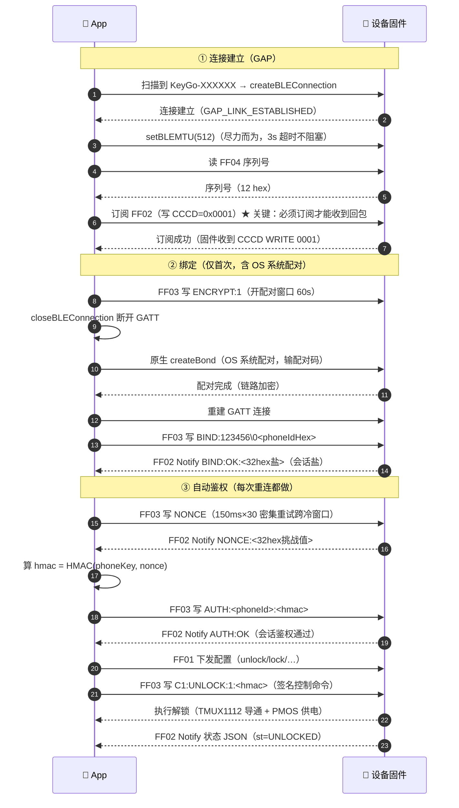
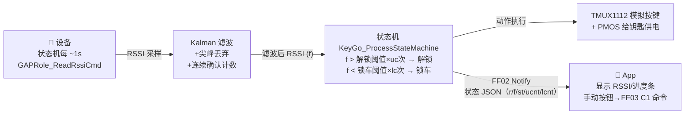

# KeyGo BLE GATT 协议详解（App ↔ 设备对话通道）

> 日期：2026-08-18
> 适用固件：CH582M_BLE_Slave v3.36.x（`code/CH582M/CH582M_BLE_Slave/`）
> 适用 App：`app/BLE_Key_Go_App/`（uni-app，stores/ble.js 为核心）
> 本文件回答：**App 与设备之间到底通过什么通道、什么格式、什么时序在通信？**

---

## 一、通道总览：4 条"电话线"（GATT 特征）

设备以 `KeyGo-XXXXXX` 名称广播（`peripheral.c` 动态构建，含 MAC 后 3 字节）。
手机连接后，双方通过一个 **KeyGo 主服务（UUID 0xFF00）** 下的 4 个特征（特征 = 一条"电话线"）通信：

| 特征 | 完整 UUID | 方向 | 属性 | 长度上限 | 干什么（一句话） |
|------|-----------|------|------|----------|------------------|
| **FF01** | `0000FF01-0000-1000-8000-00805F9B34FB` | App→设备 | Write | 80 字节 | 配置下发 / RSSI 注入 |
| **FF02** | `0000FF02-0000-1000-8000-00805F9B34FB` | 设备→App | Read + **Notify** | 200 字节 | **状态上报（JSON）+ 绑定回包（短报文）** |
| **FF03** | `0000FF03-0000-1000-8000-00805F9B34FB` | App→设备 | Write | 96 字节 | **命令通道**（控制 / 绑定 / 鉴权） |
| **FF04** | `0000FF04-0000-1000-8000-00805F9B34FB` | 设备→App | Read | 12 字节 | 设备序列号（MAC 十六进制） |

> 设备还提供标准 **Battery 服务（0x180F）**（电量百分比 Notify）与 **HID 服务（0x1812）**（无App模式锚点，让手机 OS 把它当手表/耳机自动重连）。广播包里同时声明了这三个服务（`Peripheral_BuildAdvertData`）。

**关键认知：FF02 是"设备→App"的唯一上行通道** —— 状态、绑定回包（BIND:OK / NONCE / AUTH:OK / DENY…）全部经它 Notify 出来。所以 **App 必须先订阅 FF02（写 CCCD=0x0001）**，否则设备说的一切话 App 都听不到，AUTH 必然失败。

---

## 二、各通道的"语言"（数据格式）

### 1. FF01 —— 配置下发（App 告诉设备"怎么设"）

三种写法，固件 `simpleProfileChangeCB` 自动区分：

| 内容 | 示例 | 用途 |
|------|------|------|
| 裸数字 | `-54` | 直接注入一个 RSSI 值（旧版用） |
| `rssi=` | `rssi=-54` | 同上（显式写法） |
| 配置键值对 | `unlock=-45 lock=-65 uc=3 lc=5 interval=500 kf_r=15.0 autolock=1 mode=car kpm=1` | 下发配置，固件 `KeyGo_ParseConfig` 解析并写 DataFlash |

支持的配置键（`KeyGo_ParseConfig`）：`unlock` / `lock` / `uc` / `lc` / `interval` / `kf_r` / `autolock` / `mode`（car|ebike）/ `kpm`（钥匙供电策略 0=限时15s / 1=保持到锁车）。

### 2. FF02 —— 状态上报（设备实时汇报"我这边怎么样"）

两种报文混在同一条线上，App 按前缀区分：

**① 状态 JSON（周期心跳，约 1s 一次 + 状态变化即时推）**：
```json
{"c":1,"st":"LOCKED","r":-52,"f":-52,"b":85,"t":32.5,"d2":"","cd":8000,"kr":15,
 "al":1,"bn":1,"v":"3.36.2","m":0,"uc":3,"lc":5,"ucnt":1,"lcnt":0,"th":1,
 "ou":-45,"ol":-65,"fwsec":2,"kpm":1}
```
关键字段：`st` 锁状态、`r/f` 实时/滤波后 RSSI、`b` 电量、`t` 温度、`al` 自动锁开关、`bn` 已绑定、`v` 固件版本、`m` 模式（0汽车/1电瓶车）、`ou/ol` 当前生效阈值、`fwsec` 协议能力版本（2=per-phone 授权体系）。

**② 绑定层短报文（事件驱动，即时回包）**：以 `BIND:` / `NONCE:` / `AUTH:` / `DENY:` / `ENCRYPT:` / `SETPASS:` / `PAIR:` / `CMD:` 开头，App 用 `_waitFor()` 等待对应回包。

### 3. FF03 —— 命令通道（App 让设备"干活"）

分两大类（固件 `Peripheral_HandleFF03` 按前缀路由）：

**① 绑定/鉴权类命令（明文，无签名）**：

| 命令 | 格式 | 用途 |
|------|------|------|
| `BIND` | `BIND:<绑定码>\0<phoneIdHex16>` | 首绑/接管：码 + 手机身份 |
| `NONCE` | `NONCE` | 请求挑战值（设备回 `NONCE:<32hex>`） |
| `AUTH` | `AUTH:<phoneIdHex16>:<hmacHex64>` | 挑战应答：HMAC-SHA256(nonce, phoneKey) |
| `UNBIND` | `UNBIND` / `UNBIND:ALL` | 解绑（本机 / 全部） |
| `SETCODE` | `SETCODE:<新码>` | 修改绑定码 |
| `RSSISET` | `RSSISET:<unlock>:<lock>` | 写本机专属 RSSI 阈值（per-phone） |
| `ENCRYPT` | `ENCRYPT:1` / `ENCRYPT:0` | 无App模式（OS 配对）开关 |
| `SETPASS` | `SETPASS:<6位数字>` | 设置 OS 配对码 |
| `PAIR:OPEN` | `PAIR:OPEN[:ms]` | 显式打开配对窗口 |

**② 控制类命令（C1 签名，防重放）**：`UNLOCK` / `LOCK` / `TRUNK` / `RIDE` / `NAME:<自定义名>` / `MODE:car|ebike` / `STATUS` / `EPRX:1|0`。

App 侧 `sendCommand()` 会先自动签名：`C1:<cmd>:<seq>:<hmacHex>`，其中
`hmac = HMAC-SHA256(bindKey, sessionSalt(16B) ‖ "<cmd>:<seq>")`，`seq` 为自增序号。
固件 `Bonding_VerifySignedCmd` 校验；未签名控制命令一律回 `CMD:FAIL:NO_SIG`（安全门控，2026-07-12 起强制执行）。

### 4. FF04 —— 设备序列号（Read）

设备 MAC 的 12 位十六进制（如 `60A4B7C1D2E3`），出厂永久唯一，用于：
- App 读取后以序列号为键存储绑定密钥（`keygo_bindkey_<sn>`）
- 绑定码派生：`gk = SHA256(绑定码 ‖ 序列号)[0:16]`（设备端 `Bonding_DeriveKey`）

---

## 三、完整时序图：一次"绑定 → 鉴权 → 控车"的对话



---

## 四、实时数据流：RSSI 如何驱动"走近解锁、走远锁车"



- **决策在设备端**（固件状态机），App 只负责显示与手动指令 —— 所以「无App模式」下设备也能自己解锁（OS 加密重连 + RSSI 达标即可）。
- RSSI 阈值可选 **per-phone**（v3.36）：AUTH 后 App 用 `RSSISET` 写入本机专属阈值，设备按当前鉴权 owner 选阈值（`Bonding_GetActiveOwnerRssi`）。

---

## 五、连接参数与"快/慢"的物理约束（为什么有时慢）

### 固件请求的连接参数（`peripheral.h`）

| 参数 | 值 | 含义 |
|------|-----|------|
| MIN 连接间隔 | 128 ticks = **160ms** | 想快时的下限 |
| MAX 连接间隔 | 256 ticks = **320ms** | 想省电时的上限 |
| 从机延迟 | **2** | 空闲时可跳 2 个连接事件 |
| 监督超时 | 2000 × 10ms = **20s** | 20s 无通信判死 |

> 注意：**最终间隔由手机裁决**，固件的 MIN/MAX 只是"建议范围"。Android 在后台/Doze 会自行拉长间隔（实测可到 360ms+）。

### 关键推论：GATT 回包速度 ≈ 连接间隔的倍数

- `AUTH:OK` 等 Notify 必须等**下一个连接事件窗口**才发出。
- 间隔 320ms + 延迟 2 → 最坏 `(2+1)×320ms ≈ 1s` 波动。
- 这就是"绑定验证有时慢（实测 AUTH:OK 延迟 1.2s）"的物理根因 —— 算法本身只要 19ms（2026-08-12 实测）。

### 广播参数（`peripheral.h`）

| 场景 | 间隔 | 说明 |
|------|------|------|
| 断连/上电（恒定） | **150ms** | 2026-08-05 起统一恒定广播，不降速，保证可发现性（用户要求） |
| 配对窗口内 | 20~50ms | `Bonding_ApplyPairingMode` 临时调快 |

---

## 六、稳定性自愈机制（2026-08 已落地）

| 机制 | 位置 | 作用 |
|------|------|------|
| **GATT 事务串行队列** | `utils/command-queue.js` | read/write/descriptor 共用同一条链，杜绝并发抢槽 → 从源头消灭 10007（2026-08-13 第七刀） |
| **NONCE 密集重试** | `stores/ble.js _requestNonce` | 150ms×30 次跨过连接后 ~4.2s 的 FF03 写冷窗口 |
| **FF02 到达看门狗** | `stores/ble.js _armFf02ArrivalProbe` | 订阅后 3s 无 FF02 → 重订阅 → 仍无 → 拆链重建 GATT（CCCD 失效自愈） |
| **僵尸连接探测** | `stores/ble.js _startRssiStaleWatchdog` | 4s 无 FF02 → 冻结 RSSI → 触发验证/重建 |
| **重连=首连复位** | `stores/ble.js _resetConnectionStateLikeAppRestart` | 重连时清空旧 GATT 写就绪态，避免复用陈旧上下文 |
| **固件 ATT 写快照** | `gattprofile.c` 环形缓冲 | 写回调内快照命令，避免射频中断重入覆盖 |
| **Flash 写延迟** | `bonding.c Bonding_FlushLtkFpIfPending` | AUTH/BIND 只置 dirty，1s 定时统一落盘，消除 AUTH 路径 Flash 阻塞 |
| **广播重启兜底** | `peripheral.c SBP_ADV_RESTART_EVT` | BLE Controller 卡死时重试 3 次，仍失败则软复位 |

---

## 七、诊断速查（连线不通时看什么）

| 现象 | 看哪里 | 含义 |
|------|--------|------|
| 连上即被踢 | 固件串口 `[SEC] unauth conn timeout` | 30s 内没完成 AUTH/BIND → 固件主动强断（防占槽） |
| 绑定慢 | 固件串口 `[DIAG] ParamUpd` 与 App 日志 | AUTH:OK 在等连接事件空窗（间隔×延迟） |
| FF02 静默 | 固件串口 `[FF02] [CCCD] WRITE` | App 的 CCCD 写没到 → Android 吞了，需重建 GATT |
| 写报 10007 | App 日志 + 固件 `[1007DIAG]` | GATT 事务冲突或加密握手后静默期（~1.8s），等/重试即可 |
| 偶发断连 | 固件串口 `[LINK] TERMINATED reason=` | 0x08=链路超时（信号/Doze）、0x13=手机主动关、0x16=固件主动 |
