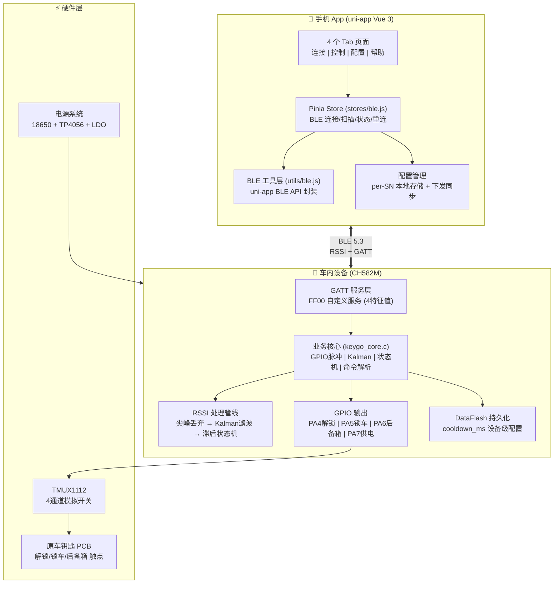
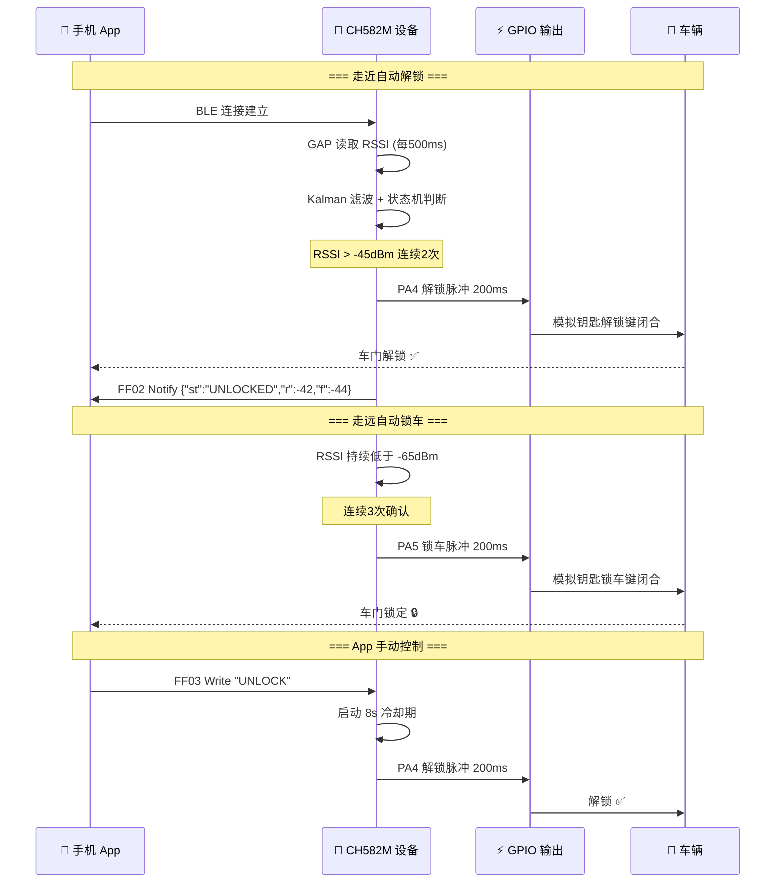
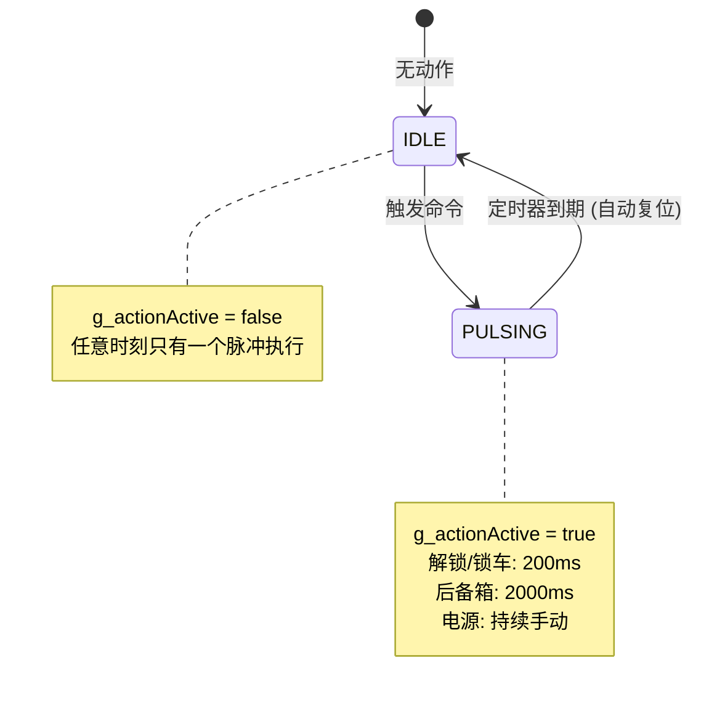
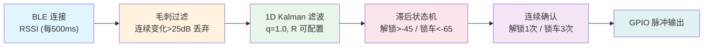
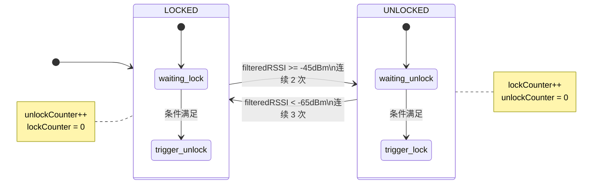

# KeyGo v3.13 项目总结报告

> **太阳能手机蓝牙NFC车钥匙 · 手机数字智能钥匙 · 手机控车**
>
> 报告日期：2026-07-02 | 当前版本：v3.13 | 平台：CH582M

---

## 目录

1. [项目概述](#1-项目概述)
2. [系统架构总览](#2-系统架构总览)
3. [开发历程](#3-开发历程)
4. [CH582M 设备端固件](#4-ch582m-设备端固件)
5. [手机 App 应用](#5-手机-app-应用)
6. [通信协议设计](#6-通信协议设计)
7. [RSSI 信号处理管线](#7-rssi-信号处理管线)
8. [安全机制现状](#8-安全机制现状)
9. [配置管理体系](#9-配置管理体系)
10. [硬件方案设计](#10-硬件方案设计)
11. [版本演进与重大修复](#11-版本演进与重大修复)
12. [已知问题与待办事项](#12-已知问题与待办事项)
13. [项目文件结构](#13-项目文件结构)

---

## 1. 项目概述

### 1.1 项目定位

KeyGo 是一个**后装式 BLE 智能车钥匙系统**，目标车型为五菱缤果。核心思路是将一个 BLE 主控芯片安装在车内，通过模拟开关接管原车钥匙的物理按键（解锁/锁车/后备箱），借助手机与设备之间的 BLE RSSI 信号强度实现**走近自动解锁、走远自动锁车**的"舒适进入"体验，同时支持 App 手动远程控制。

### 1.2 核心功能矩阵

| 功能 | 实现方式 | 状态 |
|------|----------|------|
| **自动感应解锁** | RSSI Kalman 滤波 → 双阈值状态机 → GPIO 脉冲 | ✅ 已实现 |
| **自动感应锁车** | 同上，离开阈值触发 | ✅ 已实现 |
| **App 手动控制** | BLE GATT FF03 命令通道 | ✅ 已实现 |
| **后备箱遥控** | FF03 TRUNK 命令 → 2s GPIO 脉冲 | ✅ 已实现 |
| **RSSI 实时监控** | FF02 Notify 每 200ms 推送 JSON | ✅ 已实现 |
| **运行时参数配置** | FF01 key=value 热更新 | ✅ 已实现 |
| **配置持久化** | 手机端 per-SN 存储 + 设备端 DataFlash | ✅ 已实现 |
| **自动重连** | 指数退避、原生广播驱动、僵死句柄恢复 | ✅ 已实现 |
| **BLE 安全配对** | BLE Bonding + 链路层加密 | 🔶 App 端已设计，设备端待实现 |
| **应用层 PIN 验证** | 连接后 VERIFY 命令 | 🔶 ESP32 已验证，CH582M 回滚待重新实现 |
| **太阳能供电** | 18650 + TP4056 + 太阳能板 | 📋 硬件设计中 |

### 1.3 技术栈

```
┌─────────────────────────────────────────┐
│  手机 App: uni-app (Vue 3 + Pinia)      │
│  目标平台: Android / iOS / 微信小程序     │
├─────────────────────────────────────────┤
│  设备固件: WCH CH582M (RISC-V 60MHz)    │
│  开发环境: MounRiver Studio             │
│  BLE 栈: WCH 私有 BLE 5.3 协议栈        │
│  原型平台: ESP32-C3 (Arduino IDE)       │
├─────────────────────────────────────────┤
│  硬件: TMUX1112 模拟开关 + 原车钥匙PCB  │
│  供电: 18650 锂电池 + 太阳能板          │
└─────────────────────────────────────────┘
```

---

## 2. 系统架构总览



### 2.1 核心工作流程



---

## 3. 开发历程

### 3.1 两阶段开发路线

```
阶段一: ESP32-C3 原型验证 (Arduino IDE)
  v1.1  Central 扫描手机广播 MAC ──→ ❌ 手机不主动广播 BLE
  v2.0  重构为 Peripheral 从机，设备端读 RSSI ──→ ✅ 方案可行
  v2.2  MAC 白名单 + 物理按键配对 + 设备指纹
  v3.0  双层密码信任列表
  v3.2  BLE Bonding (LE Secure Connections) + 静态 PIN 123456
  v3.5  应用层 PIN 验证 (NimBLE Just Works + VERIFY 命令)
         ├── 主动安全请求
         ├── 三路旧 bond 失效检测
         ├── 暴力破解防护 (3次/30秒)
         └── ✅ 安全方案在 ESP32 上完整验证

阶段二: CH582M 量产迁移 (MounRiver Studio)
  v3.5   基础 BLE 从机功能 (GATT 服务 + RSSI + GPIO)
  v3.5.1 FF01 配置解析 + DataFlash 持久化
  v3.6   冷却机制 (8s cooldown) + 手动命令后重置计数器
  v3.12  分类持久化策略 (per-phone vs per-device)
  v3.13  RSSI 周期可配置 + Kalman R 可配置 + 广告重启兜底
         ⚠️ 安全功能尚未迁移 (无 bonding、无加密、无 PIN)
```

### 3.2 关键决策记录

| 决策 | 时间 | 原因 |
|------|------|------|
| **Central → Peripheral** | v2.0 | 手机不主动广播 BLE，设备端做从机让手机连接是唯一可行方案 |
| **设备端读 RSSI** | v2.0 | 参考 PAN1080 方案，设备端 GAP_READ_RSSI 比手机端读更稳定 |
| **ESP32 → CH582M** | v3.5 | 功耗 (0.5μA vs 5μA)、成本 (3.8元 vs 6元)、BLE 5.3 专业性 |
| **PIN 验证暂缓** | v3.13 | ESP32 上 PIN 体验不理想，回滚代码先完善基本功能，待后续重新设计 |
| **Kalman R 可配置** | v3.13 | 不同手机/环境需要不同的平滑程度，运行时热更新提升体验 |

---

## 4. CH582M 设备端固件

### 4.1 软件架构

CH582M 固件采用**模块化分层架构**，基于 WCH TMOS 轻量级 RTOS：

```
┌─────────────────────────────────────────────┐
│               peripheral_main.c              │  ← 主入口
│  SetSysClock → CH58X_BLEInit → HAL_Init     │
│  → GAPRole_PeripheralInit → Peripheral_Init │
└────────────────────┬────────────────────────┘
                     │
┌────────────────────┴────────────────────────┐
│              peripheral.c                    │  ← 调度中心
│  TMOS 事件循环 | GAP 连接/断连回调           │
│  GATT 写回调分发 | 周期性任务调度             │
│  广告数据配置 | 参数更新 | 广播恢复兜底       │
└────────────────────┬────────────────────────┘
                     │
┌────────────────────┴────────────────────────┐
│              keygo_core.c                    │  ← 业务核心
│  GPIO 脉冲控制 | Kalman 滤波 | RSSI 处理     │
│  状态机 | JSON 通知 | 命令解析 | 配置持久化   │
└────────────────────┬────────────────────────┘
                     │
┌────────────────────┴────────────────────────┐
│              gattprofile.c                   │  ← GATT 服务
│  硬编码属性表 (4特征值) | 读写回调            │
│  FF01 (Write) | FF02 (Notify)                │
│  FF03 (Write) | FF04 (Read)                  │
└─────────────────────────────────────────────┘
```

### 4.2 GPIO 引脚映射

| 功能 | 引脚 | 方向 | 脉冲宽度 | 说明 |
|------|------|------|----------|------|
| **UNLOCK（解锁）** | PA4 | 输出 PP 5mA | ~200ms | 控制模拟开关通道1 |
| **LOCK（锁车）** | PA5 | 输出 PP 5mA | ~200ms | 控制模拟开关通道2 |
| **TRUNK（后备箱）** | PA6 | 输出 PP 5mA | ~2s | 控制模拟开关通道3 |
| **KEY_POWER（钥匙供电）** | PA7 | 输出 PP 5mA | 持续 | 控制模拟开关通道4 |
| **LED1（状态灯）** | PB15 | 输出 | — | BLE 状态指示 |
| **KEY1（按键）** | PB22 | 输入 上拉 | — | 配对/复位按键 |
| **KEY2（按键）** | PB4 | 输入 上拉 | — | 预留 |

### 4.3 脉冲控制机制

采用**非阻塞互斥脉冲**方案：



### 4.4 TMOS 事件系统

| 事件 | 掩码 | 周期 | 功能 |
|------|------|------|------|
| `SBP_START_DEVICE_EVT` | 0x0001 | 一次性 | 启动 GAP Role |
| `SBP_PERIODIC_EVT` | 0x0002 | ~1s | 周期性 JSON 状态推送 |
| `SBP_READ_RSSI_EVT` | 0x0004 | ~500ms | RSSI 读取 (可配置) |
| `SBP_PARAM_UPDATE_EVT` | 0x0008 | ~4s | BLE 连接参数更新 |
| `SBP_STATE_MACHINE_EVT` | 0x0080 | ~125ms | 状态机轮询 |
| `SBP_GPIO_PULSE_END_EVT` | 0x0100 | 一次性 | GPIO 脉冲结束复位 |
| `SBP_ADV_RESTART_EVT` | 0x0400 | ~200ms x3 | 广播恢复兜底 (v3.13新增) |

---

## 5. 手机 App 应用

### 5.1 技术栈

| 技术 | 选型 |
|------|------|
| 框架 | uni-app (跨 Android/iOS/微信小程序) |
| UI 层 | Vue 3 Composition API |
| 状态管理 | Pinia |
| 构建工具 | Vite + @dcloudio/vite-plugin-uni |
| BLE 通信 | uni-app BLE API (utils/ble.js) |

### 5.2 页面结构

```
App.vue (根组件: 全局主题 + 生命周期)
└── pages/main/main.vue (Swiper 主容器 + 4 Tab)
    ├── Tab 1: pages/index/index.vue     连接页
    │   ├── 蓝牙开关横幅 (模仿 nRF Connect)
    │   ├── 连接状态卡片 (RSSI 信号强度条)
    │   ├── 设备扫描列表
    │   ├── 设备自定义名称设置
    │   └── 快捷操作 (解锁/锁车/后备箱)
    │
    ├── Tab 2: pages/control/control.vue  控制页
    │   ├── 车辆状态大卡
    │   ├── RSSI 信息网格 (原始/滤波/阈值)
    │   ├── 主控制按钮 (解锁/锁车)
    │   ├── 手动 RSSI 模拟 (测试用)
    │   └── 冷却时间设置
    │
    ├── Tab 3: pages/config/config.vue    配置页
    │   ├── 解锁/锁车阈值滑块
    │   ├── 确认次数步进器
    │   ├── RSSI 读取间隔调节
    │   ├── Kalman R 预设按钮
    │   └── 断连锁车延时 + 下发配置
    │
    └── Tab 4: pages/login/login.vue      帮助页
        ├── 快速使用指南
        ├── 物理按键说明
        ├── BLE Bonding 安全说明
        └── 外观主题切换
```

### 5.3 BLE 通信核心

**底层工具层** (`utils/ble.js`)：

| 功能 | 关键实现 |
|------|----------|
| 蓝牙初始化 | Android 运行时权限 → 打开适配器 → 原生 Intent 兜底 |
| 设备扫描 | `services: [FF00]` 硬件级过滤 + `powerLevel: high` |
| 连接设备 | 10s 超时 + MTU 512 + "already connect" 僵死句柄恢复 |
| 配置下发 | FF01 `unlock=-45 lock=-65 uc=3 lc=5 interval=500 kr=15` |
| 命令发送 | FF03 UNLOCK / LOCK / TRUNK / STATUS / NAME:xxx |
| 序列号读取 | GATT 特征发现 → 确认 FF04 存在 → 读取 12 位 hex |

**状态管理层** (`stores/ble.js`)：

- FF02 Notify 数据 200ms 缓冲区拼接（应对分包）
- JSON 短键名解析：`c`(connected) / `st`(state) / `r`(raw RSSI) / `f`(filtered) / `d2`(设备名) / `cd`(冷却时间)
- 指数退避自动重连（1s→2s→4s…→30s, 最多10次）
- 会话锁 `_reconnectGuard` 防止蓝牙开关期间的竞态
- 原生 BroadcastReceiver 直连系统蓝牙广播（Android）

---

## 6. 通信协议设计

### 6.1 GATT 服务定义

```
Service UUID:  0000FF00-0000-1000-8000-00805F9B34FB

┌────────┬──────────┬──────────┬──────────────────────────────┐
│ 特征值  │ UUID     │ 属性      │ 用途                          │
├────────┼──────────┼──────────┼──────────────────────────────┤
│  FF01  │ 0xFF01   │ Write     │ RSSI 注入 + 配置下发           │
│        │          │ (80 bytes)│ 格式: key=value 或 rssi=-54    │
├────────┼──────────┼──────────┼──────────────────────────────┤
│  FF02  │ 0xFF02   │ Notify    │ 状态 JSON 推送 (200 bytes)     │
│        │          │ (200bytes)│ {"c":1,"st":"LOCKED","r":-42}  │
├────────┼──────────┼──────────┼──────────────────────────────┤
│  FF03  │ 0xFF03   │ Write     │ 命令通道 (50 bytes)            │
│        │          │ (50 bytes)│ UNLOCK/LOCK/TRUNK/NAME:xxx     │
├────────┼──────────┼──────────┼──────────────────────────────┤
│  FF04  │ 0xFF04   │ Read      │ 设备序列号 (12 hex)            │
│        │          │ (12 bytes)│ MAC 导出的永久唯一标识          │
└────────┴──────────┴──────────┴──────────────────────────────┘
```

### 6.2 FF01 配置格式

App 下发时使用一行空格分隔的 `key=value` 字符串，设备端自动解析：

```
unlock=-45 lock=-65 uc=2 lc=3 interval=500 dlock=5000 cooldown_ms=8000 kr=15
```

| Key | 变量 | 说明 | 默认值 | 持久化 |
|-----|------|------|--------|--------|
| `unlock` | 解锁阈值 | dBm，信号高于此值触发解锁 | -45 | RAM (per-phone) |
| `lock` | 锁车阈值 | dBm，信号低于此值触发锁车 | -65 | RAM (per-phone) |
| `uc` | 解锁确认次数 | 需连续满足的次数 | 2 | RAM (per-phone) |
| `lc` | 锁车确认次数 | 需连续满足的次数 | 3 | RAM (per-phone) |
| `interval` | RSSI 读取周期 | 毫秒 | 500 | RAM (per-phone) |
| `dlock` | 断连锁车延时 | 毫秒 | 5000 | RAM (per-phone) |
| `cooldown_ms` | 冷却时间 | 手动命令后的保护期 | 8000 | **DataFlash** (per-device) |
| `kr` | Kalman R 值 | 越大越平滑 | 15 | RAM |
| `rssi` | RSSI 注入值 | 测试用，直接注入 Kalman | — | — |

### 6.3 FF02 JSON 状态通知

设备每 ~200ms 通过 Notify 推送短键名 JSON：

```json
{
  "c": 1,           // 连接状态: 1=已连接
  "st": "LOCKED",   // 车辆状态: LOCKED | UNLOCKED | ACTION
  "r": -54,         // 原始 RSSI (raw)
  "f": -52,         // Kalman 滤波后 RSSI (filtered)
  "d2": "我的缤果",  // 用户自定义设备名
  "cd": 8000,       // 当前冷却时间 (ms)
  "kr": 15          // 当前 Kalman R 值 (v3.13新增)
}
```

### 6.4 FF03 命令集

| 命令 | 需鉴权 | 功能 | 额外行为 |
|------|--------|------|----------|
| `UNLOCK` | ✅ | 手动解锁 | 脉冲 200ms + 重置状态机计数器 + 启动冷却 |
| `LOCK` | ✅ | 手动锁车 | 脉冲 200ms + 重置状态机计数器 + 启动冷却 |
| `TRUNK` | ✅ | 开启后备箱 | 脉冲 2000ms |
| `NAME:xxx` | ✅ | 设置设备名 | 写入 RAM + DataFlash |

> **注意**：ESP32 版本额外支持 `VERIFY`(PIN验证) 和 `PIN:x`(设置PIN)，CH582M 尚未实现。

### 6.5 FF01 数据格式自动识别

设备端能智能识别三种数据格式：

```
裸数字:    -54          → RSSI 注入
rssi=前缀: rssi=-54     → RSSI 注入
配置字符串: unlock=-45... → 配置更新 (跳过 rssi key)
```

---

## 7. RSSI 信号处理管线

### 7.1 处理流程



### 7.2 Kalman 滤波器

一维随机游走模型，用于平滑 RSSI 噪声：

```
预测:  X_pred = X
       P_pred = P + Q    (Q = 1.0)

更新:  K = P_pred / (P_pred + R)    (R 默认 15，可配置 2~50)
       X = X + K * (Z - X)
       P = (1 - K) * P
```

| 参数 | 含义 | 默认值 | App 预设 |
|------|------|--------|----------|
| Q | 过程噪声（跟踪速度） | 1.0 | — |
| R | 测量噪声（平滑程度） | 15 | 极速2/快速5/标准15/稳定50 |

### 7.3 毛刺过滤策略

```
连续两帧变化 > 25dBm → 视为毛刺 → 不喂入 Kalman
连续毛刺次数 < 2 (SPIKE_DISCARD_COUNT) → 丢弃该样本
只有当毛刺持续出现（真实趋势变化）→ 放行喂入 Kalman
```

### 7.4 滞后状态机



**中间区域 (-65dBm ~ -45dBm) 不触发任何动作**，天然滞后防止边界反复切换。

---

## 8. 安全机制现状

### 8.1 ESP32 vs CH582M 安全对比

| 安全功能 | ESP32-C3 v3.13 | CH582M v3.13 |
|----------|----------------|--------------|
| **BLE Bonding** | ✅ LE Secure Connections + Bonding | ❌ 无 |
| **GATT 加密权限** | ✅ `ESP_GATT_PERM_*_ENCRYPTED` | ❌ 裸奔 `GATT_PERMIT_WRITE/READ` |
| **配对 PIN** | ✅ 静态 PIN 123456 | ❌ 无配对机制 |
| **MAC 白名单** | ✅ 完整 (countBondedDevices) | ❌ 无 |
| **物理按键配对** | ✅ PIN 9: 短按配对 / 长按出厂 | ❌ 未实现 |
| **应用层 PIN 验证** | ✅ VERIFY 命令 + 暴力破解防护 | ❌ 无 |
| **旧 bond 失效检测** | ✅ 三路兜底 | ❌ 不适用 |

### 8.2 当前 CH582M 安全状态

**所有 GATT 访问均为明文**，注释中标注 "到时候需要配对再加密"：

```c
// gattprofile.c 关键注释
// 特征值 FF01:  "到时候需要配对再加密"
// 特征值 FF02:  "到时候需要配对再加密"  
// 特征值 FF03:  "到时候需要配对再加密"
// 特征值 FF04:  "到时候需要配对再加密"
```

**CH582M 具备但不使用的安全能力**：

```c
// config.h
#define BLE_SNV_ADDR  0x77E00    // Bonding 持久化区域已预留
#define BLE_SNV_NUM   1          // 可存储 1 组配对信息

// 可用但未启用的权限
GATT_PERMIT_AUTHEN_READ     // 需认证读取
GATT_PERMIT_AUTHEN_WRITE    // 需认证写入
GATT_PERMIT_ENCRYPT_READ    // 需加密读取
GATT_PERMIT_ENCRYPT_WRITE   // 需加密写入
```

### 8.3 ESP32 PIN 验证方案回顾 (供后续参考)

ESP32 v3.5 验证了完整的应用层 PIN 方案：

```
连接建立 → FF02 Notify (加密后 d2 字段才显示真实设备名)
  → App 发送 PIN:123456 (明文)
  → 设备验证 PIN (字符串比对)
    ├── 正确 → 设备标记为"已验证" → 后续命令放行
    └── 错误 → 累计错误次数
         ├── < 3次 → 允许重试
         └── >= 3次 → 30 秒截止期 (防暴力破解)
              → 期间拒绝所有 PIN 尝试
```

**回滚原因**：体验不理想（具体表现为配对流程繁琐、用户需要额外输入 PIN），先回滚完善基本功能，待重新设计更友好的安全方案。

---

## 9. 配置管理体系

### 9.1 三层配置架构

```
第 1 层: 手机 App 本地存储
  └── uni-app Storage: ble_config_v1_{SN}
       ├── unlockThreshold
       ├── lockThreshold
       ├── unlockCountRequired
       ├── lockCountRequired
       ├── rssiReadPeriodMs
       ├── disconnectLockDelayMs
       └── kalmanR
       (按设备序列号独立存储，不同手机可设不同阈值)

第 2 层: 设备 RAM (运行时)
  └── 连接成功后 App 自动下发
       "unlock=-45 lock=-65 uc=2 lc=3 interval=500 dlock=5000 kr=15"
       (断电丢失，每次连接重新下发)

第 3 层: 设备 DataFlash (持久化)
  └── 地址 0x77000 (16 bytes)
       ├── magic (0x4B474346 = "KGCF")
       ├── cooldownMs (所有手机共享)
       └── checksum (XOR 校验)
```

### 9.2 持久化策略 (v3.12)

| 分类 | 存储位置 | 参数 | 说明 |
|------|----------|------|------|
| **Per-phone** | 手机本地 Storage + 设备 RAM | unlock, lock, uc, lc, interval, dlock, kr | 不同手机不同阈值，每次连接下发 |
| **Per-device** | 设备 DataFlash | cooldown_ms | 所有手机共享，变更时写入 Flash |

### 9.3 配置下发时序

```
手机连接成功
  → SN 就绪 (读取 FF04)
  → _loadConfigForDevice(sn)     // 从本地存储恢复 per-SN 阈值
  → _syncConfigToDevice()         // 拼接 key=value 发送到 FF01
      ┌─────────────────────────────┐
      │ FF01 Write:                 │
      │ "unlock=-45 lock=-65 uc=2   │
      │  lc=3 interval=500          │
      │  dlock=5000 kr=15"          │
      └─────────────────────────────┘
  → 设备解析 → 更新 RAM 变量 → 生效
```

---

## 10. 硬件方案设计

### 10.1 系统供电架构

```
太阳能板 (5V/1W)
    │
    ▼
TP4056 充电管理 ──→ 18650 锂电池 (3.7V / 2500mAh)
    │                    │ 过充保护 4.2V
    │ 充电保护            │ 过放保护 2.8V
    │                    ▼
    └────────────── ME6211 LDO (3.3V / 300mA)
                         │
              ┌──────────┼──────────┐
              ▼          ▼          ▼
          CH582M     TMUX1112   太阳能板ADC采样
          VDD        VDD
```

### 10.2 功耗估算

| 工作模式 | 电流 | 占空比 | 日均功耗 |
|----------|------|--------|----------|
| BLE 广播等待 | ~1.5mA | ~20% | 7.2mAh |
| BLE 连接保持 | ~10μA | ~80% | 0.2mAh |
| TMUX1112 | 9nA | 100% | 忽略 |
| **系统总计** | — | — | **~7.4mAh/天** |
| **纯电池续航** | — | — | **~338天** |
| **加太阳能** | 日均补电 ~400mAh | — | **永不断电** |

### 10.3 BOM 清单

| 序号 | 器件 | 型号 | 数量 | 参考价 |
|------|------|------|------|--------|
| 1 | BLE 主控 | CH582M | 1 | ¥3.8 |
| 2 | 模拟开关 | TMUX1112PWR | 1 | ¥4.5 |
| 3 | 充电 IC | TP4056 | 1 | ¥0.8 |
| 4 | LDO | ME6211A33M3G | 1 | ¥0.5 |
| 5 | 太阳能板 | 5V/1W | 1 | ¥8.0 |
| 6 | 18650 电池 | 2500mAh | 1 | ¥12.0 |
| 7 | 晶振 | 32MHz | 1 | ¥0.3 |
| 8 | 天线 | 2.4G PCB/FPC | 1 | ¥1.0 |
| 9 | 被动器件 | R/C 等 | ~20 | ¥2.0 |
| 10 | 连接器 | 4P 排针 | 1 | ¥0.3 |
| | **合计** | | | **~¥33** |

### 10.4 钥匙改装要点

```
五菱缤果钥匙内部 (典型低端遥控钥匙):
  ● 电池: CR2032 (3V)
  ● 按键: 3 个导电橡胶触点
  ● 射频: 433MHz 滚动码

改装步骤:
  1. 拆开钥匙壳体 (超声波焊接，沿中缝撬开)
  2. 万用表确认每个按键的 GND 端和信号端
  3. 信号端 → 飞线 → TMUX1112 Sx 引脚
  4. GND 端 → 飞线 → TMUX1112 Dx 引脚
  5. 电池供电改为 TMUX1112 第4通道控制

TMUX1112 优势:
  ✅ 双向开关，不关心极性
  ✅ Ron 仅 2Ω，远小于按键接触电阻
  ✅ 漏电流 3pA，关断完全隔离
  ✅ 先断后合，防止短接
```

---

## 11. 版本演进与重大修复

### 11.1 CH582M 固件版本

| 版本 | 关键变更 |
|------|----------|
| **v3.5** | 基础 BLE 从机功能：GATT 服务、RSSI 读取、GPIO 脉冲、状态机 |
| **v3.5.1** | FF01 配置解析 + DataFlash 配置持久化 + FF01 缓冲区扩容至 80 字节 |
| **v3.6-fixH** | 冷却时间 3s→8s、手动命令后重置状态机计数器（防冷却后覆盖） |
| **v3.7** | cooldown_ms 可运行时配置 + DataFlash 持久化 |
| **v3.12** | 分类持久化策略：per-phone (RAM) vs per-device (Flash) |
| **v3.13** | RSSI 读取周期可配置 (interval)、Kalman R 可配置 (kr)、广播重启兜底机制、JSON 新增 kr 字段 |

### 11.2 App 端版本

| 版本 | 关键变更 |
|------|----------|
| **v3.2** | BLE Bonding 安全方案 + 连接即授权 |
| **v3.11** | 当前版本：FF04 序列号读取、per-SN 配置存储、kalman R 预设按钮 |
| **v3.12** | 配置按设备序列号独立存储，旧版全局配置自动迁移 |
| **v3.13** | 移除手机端 RSSI 转发，完全依赖设备 GAP RSSI 自读 |

### 11.3 App 端重大 Bug 修复

| Bug | 现象 | 根因 | 修复 |
|-----|------|------|------|
| 按钮卡死 | 快速点击无响应 | uni-app BLE API 并发写冲突 | 序列化 FF01/FF03 写入 |
| 扫描静默失败 | 断开后无法扫描 | BLE 适配器状态未重置 | 断开后强制重置适配器 |
| 监听器堆积 | 重连后数据重复 | 旧监听器未清理 | 连接前清理全局监听 |
| 同名设备"复活" | 已断开设备重复出现 | deviceId 未去重 | 按 mac 地址去重 + 状态过滤 |
| 主题闪烁 | 深色/浅色切换时闪烁 | CSS 变量继承 + Pinia 响应性 | theme-fix-retrospective 四重修复 |

---

## 12. 已知问题与待办事项

### 12.1 高优先级

| 事项 | 状态 | 说明 |
|------|------|------|
| **BLE 安全机制迁移** | 📋 待实现 | ESP32 已验证的 Bonding + PIN 方案需迁移到 CH582M |
| **应用层 PIN 体验优化** | 📋 待重新设计 | ESP32 上 VAN 体验不理想，需更友好的交互设计 |
| **恢复出厂设置** | 📋 待实现 | 长按按键 5s 清除所有配置 (ESP32 已实现) |
| **物理按键配对模式** | 📋 待实现 | 短按进入 30s 配对窗口 (ESP32 已实现) |
| **LED 状态完整指示** | 📋 待完善 | 当前仅基础闪烁，未实现绑定/配对/连接状态区分 |

### 12.2 中优先级

| 事项 | 状态 | 说明 |
|------|------|------|
| **NFC 功能扩展** | 📋 远期规划 | 手机没电时 NFC 碰一碰开锁 |
| **IMU 姿态检测** | 📋 远期规划 | 区分"走近"和"路过"，减少误触发 |
| **多设备绑定** | 📋 远期规划 | 支持多台手机（家庭共享） |
| **固件 OTA 升级** | 📋 远期规划 | 通过 BLE 空中升级 CH582M 固件 |
| **低功耗深度睡眠** | 📋 待优化 | 当前 HAL_SLEEP=FALSE，连接保持可降至 10μA |
| **钥匙分享功能** | 📋 远期规划 | 生成临时授权码分享给家人朋友 |

### 12.3 文档类

| 事项 | 说明 |
|------|------|
| ESP32 → CH582M 迁移笔记 | 记录安全方案迁移的具体步骤和注意事项 |
| API 接口文档 | CH582M 固件模块间的接口规范 |
| App 代码注释完善 | 部分 utils/ble.js 函数缺少 JSDoc |

---

## 13. 项目文件结构

```
KeyGo/
├── code/
│   ├── CH582M/CH582M_BLE_Slave/       ← 当前主力平台
│   │   ├── APP/
│   │   │   ├── peripheral_main.c      (主入口, TMOS 初始化)
│   │   │   ├── peripheral.c           (调度中心, 事件循环)
│   │   │   ├── keygo_core.c           (业务核心: GPIO/Kalman/状态机/配置)
│   │   │   └── include/
│   │   │       ├── peripheral.h       (事件/状态/结构体定义)
│   │   │       └── keygo_core.h       (核心模块 API)
│   │   ├── Profile/
│   │   │   ├── gattprofile.c          (FF00 自定义 GATT 服务)
│   │   │   └── devinfoservice.c       (标准设备信息服务)
│   │   ├── HAL/                        (硬件抽象层)
│   │   │   ├── MCU.c / LED.c / KEY.c / RTC.c / SLEEP.c
│   │   │   └── include/config.h       (GPIO 引脚映射)
│   │   ├── StdPeriphDriver/           (WCH 标准外设驱动)
│   │   └── LIB/                        (预编译 BLE 协议栈)
│   │
│   └── ESP32C3/                        ← 原型验证平台 (已完成使命)
│       ├── BLE_Key_Go/                (v1.1 Central 扫描原型)
│       ├── BLE_Key_Go_v2/             (v2.0 Peripheral 重构)
│       ├── BLE_Key_Go_v2_1/ ~ v2_3/  (v2.x 白名单/设备指纹)
│       ├── BLE_Key_Go_v3_0/ ~ v3_4/  (v3.x 双层密码/Bonding/PIN)
│       ├── BLE_Key_Go_v3_5/           (v3.5 最完整安全版)
│       └── BLE_Key_Go_v3_13/          (v3.13 CH582M 参数对齐版)
│
├── app/
│   └── BLE_Key_Go_App/                 ← 手机 App (v3.11)
│       ├── pages/
│       │   ├── main/main.vue           (主容器: Swiper + TabBar)
│       │   ├── index/index.vue         (连接页)
│       │   ├── control/control.vue     (控制页)
│       │   ├── config/config.vue       (配置页)
│       │   └── login/login.vue         (帮助页)
│       ├── stores/
│       │   ├── ble.js                  (BLE 核心 Store)
│       │   ├── user.js                 (用户身份 Store)
│       │   └── theme.js                (主题 Store)
│       ├── utils/
│       │   ├── ble.js                  (BLE API 封装)
│       │   ├── ble-native.js           (Android 原生广播)
│       │   └── swipe.js / toast.js
│       ├── components/
│       │   └── CustomTabBar.vue
│       └── static/                     (图标资源)
│
└── docs/                               ← 项目文档
    ├── KeyGo_v3.13_项目总结报告.md      (本文档)
    ├── BLE车钥匙舒适进入_硬件方案设计.md
    ├── BLE车钥匙舒适进入_项目立项书.md
    ├── BLE车钥匙_方案梳理v2.md
    ├── BLE_Key_Go_项目规划.md
    ├── BLE扫描_设备发现机制复盘_v2.2.md
    ├── BLE连接稳定性问题复盘_v2.2.md
    ├── KeyGo_v3.2_设备识别方案深度分析.md
    ├── KeyGo_方案对比分析_市场主流方案.md
    └── theme-fix-retrospective.md
```

---

## 附录 A: 快速参考

### A.1 CH582M 引脚速查

| 功能 | 引脚 | 操作 |
|------|------|------|
| 解锁 | PA4 | 高电平 200ms |
| 锁车 | PA5 | 高电平 200ms |
| 后备箱 | PA6 | 高电平 2000ms |
| 钥匙供电 | PA7 | 持续高/低 |
| 状态灯 | PB15 | 闪烁/常亮 |
| 按键1 | PB22 | 输入上拉 |
| 按键2 | PB4 | 输入上拉 |

### A.2 GATT 特征值速查

| UUID | 方向 | 数据格式 |
|------|------|----------|
| FF01 | Write | 配置: `key=value key=value...` 或 RSSI: `rssi=-54` |
| FF02 | Notify | JSON: `{"c":1,"st":"LOCKED","r":-42,"f":-44}` |
| FF03 | Write | 命令: `UNLOCK` / `LOCK` / `TRUNK` / `NAME:xxx` |
| FF04 | Read | 12 位 hex 序列号 |

### A.3 默认配置参数

| 参数 | CH582M 默认 | ESP32 默认 | 说明 |
|------|-------------|------------|------|
| 解锁阈值 | -45 dBm | -45 dBm | 一致 |
| 锁车阈值 | -65 dBm | -65 dBm | 一致 |
| 解锁确认 | 2 次 | 3 次 | CH582M 略激进 |
| 锁车确认 | 3 次 | 5 次 | CH582M 略激进 |
| Kalman Q | 1.0 | 1.0 | 一致 |
| Kalman R | 15 | 15 | 一致 |
| RSSI 周期 | 500ms | 500ms | 一致 |
| 冷却时间 | 8000ms | 8000ms | 一致 |
| 尖峰阈值 | 25dB | 25dB | 一致 |

---

> **报告生成时间**: 2026-07-02 | **分析工具**: WorkBuddy CodeBuddy | **项目版本**: v3.13
