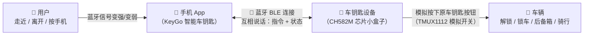
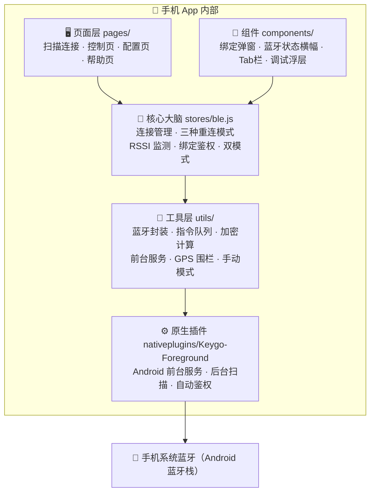
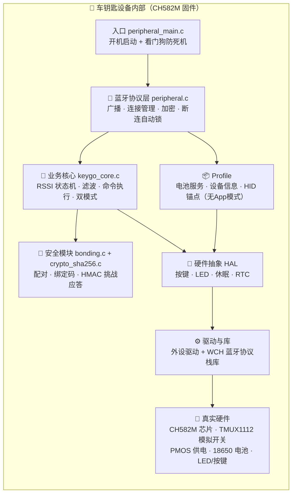
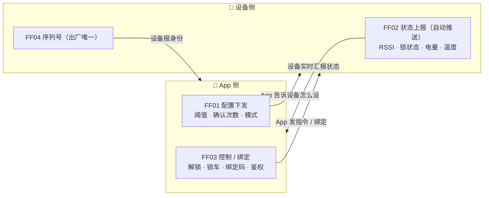

# KeyGo 架构图（给不懂代码的人看）

> KeyGo · 钥启程 = **用手机蓝牙当车钥匙**。
> 一句话：**手机 App ↔ 蓝牙 ↔ 车钥匙设备（小盒子）↔ 原车钥匙按钮 ↔ 车辆**。
> 走近自动解锁，走远自动锁车，全靠蓝牙信号强度（RSSI）判断距离。

---

## 图 1：系统总览（端到端，一眼看懂）



**这四层的关系：**

| 层 | 是什么 | 干什么 |
|----|--------|--------|
| 👤 用户 | 人 | 走近、走远、点手机上的按钮 |
| 📱 手机 App | 软件（本仓库 `app/`） | 连接设备、测距离、发解锁/锁车指令、绑定鉴权 |
| 🔑 车钥匙设备 | 硬件 + 固件（本仓库 `code/CH582M/`） | 蓝牙从机，判断距离后模拟按键（TMUX1112），用 PMOS 给原车钥匙板供电 |
| 🚗 车辆 | 原车 | 收到钥匙按键信号，执行解锁/锁车 |

> 🔌 **作动硬件（不是继电器）**：设备通过 **TMUX1112 4 通道模拟开关**（3 路模拟解锁/锁车/后备箱按键，双向导通等效按键按下）+ **PMOS 高侧开关**（GPIO `PB0=KEY_POWER` 拉低给原车钥匙板供电，低有效）来控制原车钥匙。详见 `docs/01-项目规划与立项/3-硬件/KeyGo_硬件方案概览.md` 与 `docs/02-技术方案与专项设计/6-电池/2026-08-14_钥匙供电策略_改动清单与实施记录.md`。

> 早期原型用 ESP32C3（Arduino）做过，现在主力是 WCH CH582M（RISC-V BLE SoC），两者固件都在 `code/` 下。

---

## 图 2：手机 App 内部结构

App 是 **uni-app（Vue 3 + Pinia）** 写的 Android 应用，目录 `app/BLE_Key_Go_App/`。



**各模块分工（大白话）：**

| 模块 | 文件 | 干什么 |
|------|------|--------|
| 🖥 页面层 | `pages/index` 扫描连接、`control` 控制、`config` 配置、`help` 帮助 | 用户看到的界面 |
| 🧠 核心大脑 | `stores/ble.js`（约 5800 行） | **App 的心脏**：所有连接、重连、鉴权、RSSI 逻辑都在这 |
| 🧩 绑定弹窗 | `components/BindModal.vue` | 输入绑定码、验证绑定、解绑 |
| 🔧 蓝牙封装 | `utils/ble.js` | 调用系统蓝牙 API 扫描/连接/收发数据 |
| 🔧 指令队列 | `utils/command-queue.js` | 指令排队发送，防止蓝牙通道冲突 |
| 🔧 加密计算 | `utils/crypto.js` | 算密钥（SHA256/HMAC），与设备端算法一致 |
| 🔧 前台服务 | `utils/foreground-service.js` + 原生插件 | 让 App 在后台不被系统杀死，持续保持连接 |
| 🔧 GPS 围栏 | `utils/geofence.js` | 「极速模式」：到车附近才自动扫描连接 |
| 🔧 手动模式 | `utils/power-saver.js` | 「手动模式」：完全手动，不自动连不自动锁 |

---

## 图 3：车钥匙设备（固件）内部结构

固件是 C 语言写的，跑在 CH582M 芯片上，目录 `code/CH582M/CH582M_BLE_Slave/`。



**各模块分工（大白话）：**

| 模块 | 文件 | 干什么 |
|------|------|--------|
| 📡 蓝牙协议层 | `peripheral.c` | 对外广播"我叫 KeyGo-XXXXXX"，管理蓝牙连接、配对加密 |
| 🧠 业务核心 | `keygo_core.c` | **设备的大脑**：根据 RSSI 判断"人走近了没"，决定解锁/锁车；处理手机发来的命令；存储配置 |
| 🔐 安全模块 | `bonding.c`、`crypto_sha256.c` | 绑定鉴权：设备发随机数 → 手机用密钥算签名 → 设备验证，防止陌生人开门 |
| 📦 Profile | `gattprofile.c`、`battery_service.c`、`keygo_hid.c` 等 | 蓝牙"服务"：上报电量、温度；HID 锚点让手机 OS 把它当手表/耳机自动重连（无App模式） |
| 🔌 硬件抽象 | `HAL/KEY.c`、`LED.c`、`SLEEP.c` 等 | 直接操作按键、LED、休眠，隔离硬件差异 |

---

## 图 4：App 与设备之间的"对话协议"（蓝牙 GATT 通道）

两者通过蓝牙的 4 条通道（GATT 特征 FF00~FF04）通信：



**举例（大白话流程）：**

1. 手机扫到 `KeyGo-XXXXXX` → 点连接
2. 连上后读 **FF04** 序列号，发绑定码 `BIND` → 设备验证 → 双方建立信任（`AUTH` 挑战应答）
3. 设备持续通过 **FF02** 汇报信号强度（RSSI）
4. 手机走近 → RSSI 变强 → 手机（或设备自己）判定"到了" → 发 `UNLOCK`（**FF03**）→ 设备让 TMUX1112 导通模拟按下解锁键（同时 PMOS 给原车钥匙板上电）
5. 走远 → RSSI 变弱 → 自动 `LOCK` 锁车
6. 想调灵敏度？App 通过 **FF01** 把新阈值下发给设备

> 📖 **想深入了解协议？** 完整版（每条通道的数据格式、绑定→鉴权→控车的时序图、连接参数对速度的影响、稳定性自愈机制、诊断速查）见 [`docs/02-技术方案与专项设计/2026-08-18_GATT协议详解.md`](02-技术方案与专项设计/2026-08-18_GATT协议详解.md)。

---

## 附：完整目录地图

```
KeyGo/
├── app/BLE_Key_Go_App/        # 📱 手机 App（uni-app Vue3）
│   ├── pages/                 #   页面（扫描/控制/配置/帮助）
│   ├── stores/                #   状态管理（ble.js 是核心大脑）
│   ├── utils/                 #   工具（蓝牙/加密/围栏/省电）
│   ├── components/            #   组件（绑定弹窗等）
│   └── nativeplugins/         #   Android 原生插件（前台服务）
├── code/
│   ├── CH582M/CH582M_BLE_Slave/   # 🔑 主力固件（C 语言）
│   │   ├── APP/               #   业务（协议层/核心/安全/入口）
│   │   ├── HAL/               #   硬件抽象（按键/LED/休眠）
│   │   ├── Profile/           #   蓝牙服务（电池/HID等）
│   │   └── LIB/ + StdPeriphDriver/  # WCH 官方协议栈与驱动
│   └── ESP32C3/               # ⏳ 早期原型（Arduino，已归档）
├── docs/                      # 📚 设计文档与复盘
└── README.md                  # 总说明
```
